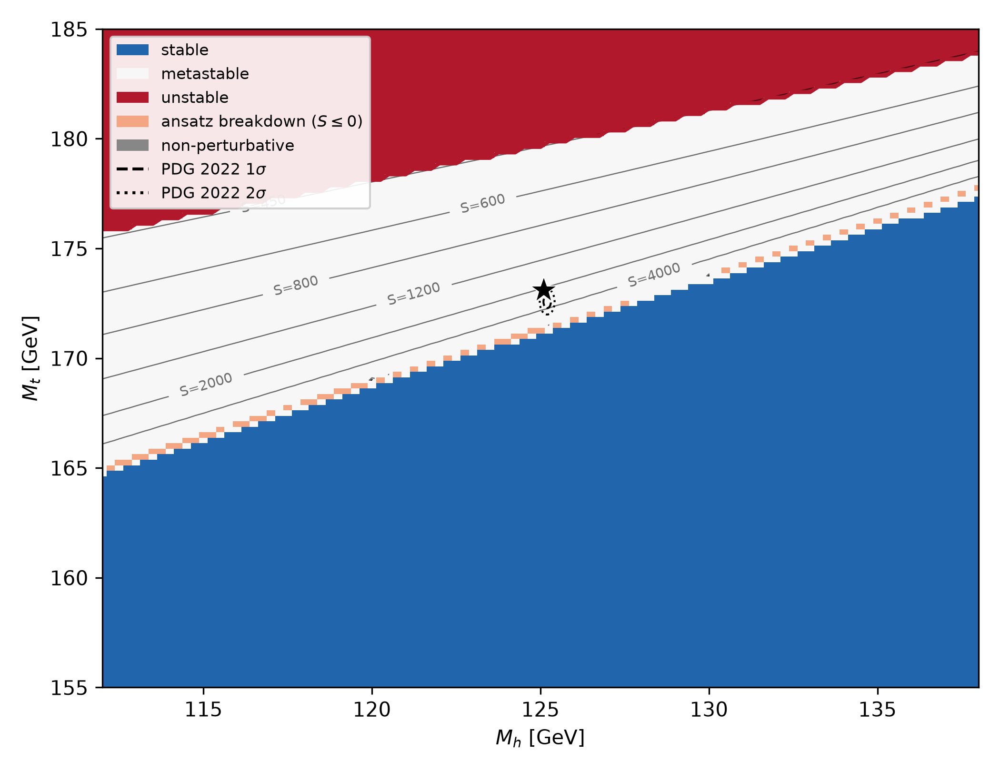
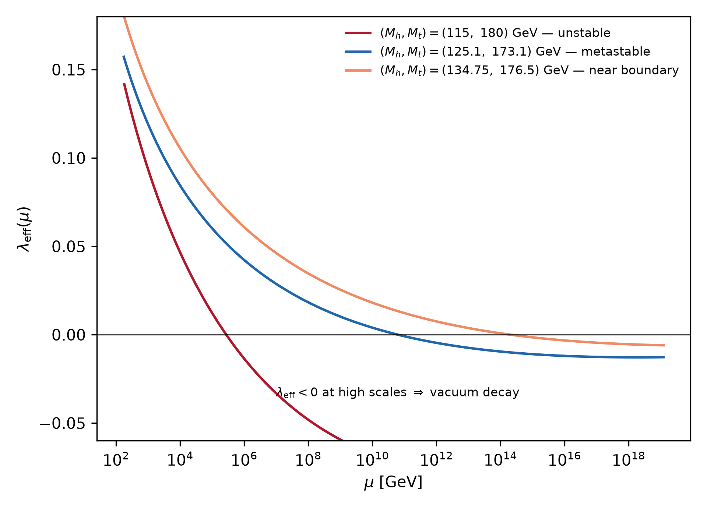
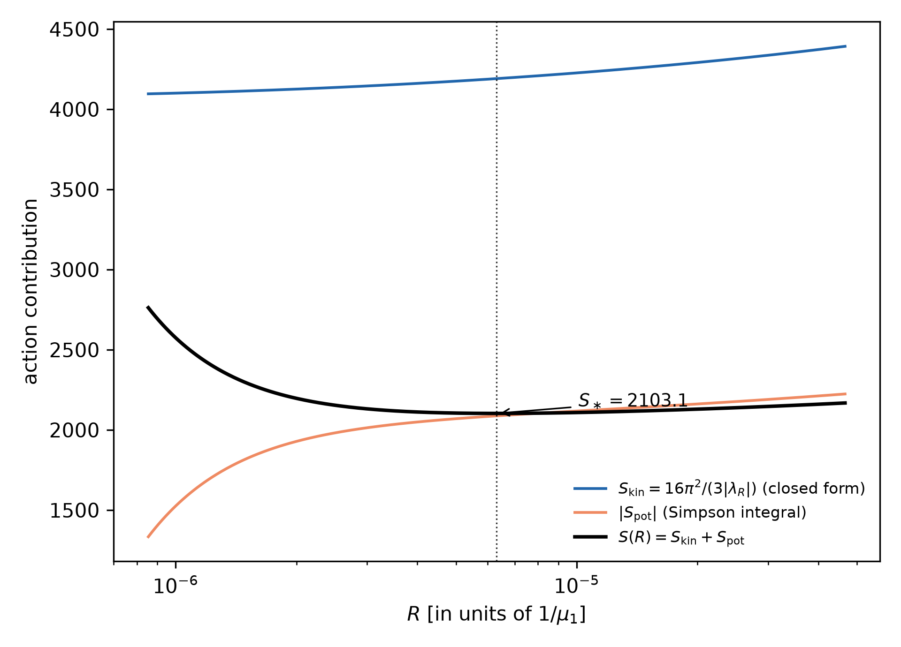
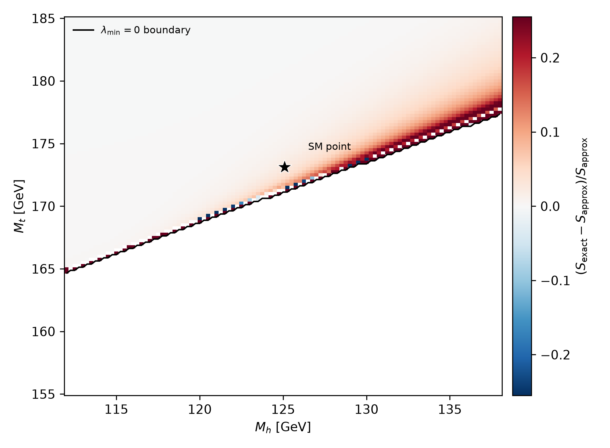

# SMVac-Research

Numerical study of electroweak vacuum stability in the Standard Model.

This repository implements a semi-analytical bounce-action estimator — the
Fubini–Lipatov (conformal) profile evaluated on the RG-improved 1-loop
effective potential — to investigate where the Standard Model vacuum is
absolutely stable, metastable, or unstable in the $(M_h, M_t)$ plane, and to
quantify when the strict conformal approximation is adequate.



*Stability of the SM vacuum in the Higgs–top mass plane. Blue: the
RG-improved quartic coupling stays positive up to the Planck scale (absolute
stability). White: the coupling turns negative but the estimated decay
action exceeds the age-of-the-universe threshold (metastable). Red: the
action falls below the threshold. Orange: points where the conformal ansatz
breaks down (non-positive action) adjacent to the stability boundary — a
documented artifact of the method, not a physical instability. Contours:
optimized ansatz action $S$. The star marks the benchmark point
$(125.1, 173.1)$ GeV; the ellipses show the PDG 2022 $1\sigma$/$2\sigma$
region.*

## What the code computes

1. **Matching.** NNLO electroweak matching conditions at the top scale
   (Buttazzo et al. 2013), linearized around the central masses.
2. **Running.** The 3-loop SM RG equations for
   $(g_1, g_2, g_3, y_t, y_b, y_\tau, \lambda)$, integrated by RK4 from
   $M_t$ to the Planck scale.
3. **Potential.** The RG-improved 1-loop effective potential
   $V(\phi) = \lambda_{\rm eff}(\phi)\,\phi^4/4$ with $\mu = \phi$ (the
   high-field approximation: the false vacuum sits at the origin).
4. **Action.** The bounce action evaluated on the conformal profile with a
   running-coupling amplitude, minimized over the profile scale; plus the
   strict conformal estimate $S_{\rm approx} = 8\pi^2/(3|\lambda_{\min}|)$.
5. **Classification.** Stable / metastable / unstable via the Coleman
   criterion $\Gamma/V \sim t_U^{-4}$ with $t_U = 10$ Gyr.

**Scope and honesty of the method.** The bounce equation is *not* solved;
the profile family is fixed (conformal) and only its scale is optimized, so
the reported action is a **variational upper bound** on the true bounce
action. The *stability boundary* ($\lambda_{\min} = 0$) does not depend on
the ansatz and is the robust output; absolute lifetimes in the metastable
region inherit the ansatz systematics. All approximations are documented in
[docs/theory.md](docs/theory.md) and
[docs/limitations.md](docs/limitations.md).

## Main results (reproduced by the committed example data)

* At the benchmark point $(M_h, M_t) = (125.1, 173.1)$ GeV the vacuum is
  **metastable**: $\lambda_{\rm eff}$ crosses zero at $\mu_1 \simeq
  6.2\times10^{10}$ GeV, the optimized ansatz action is
  $S_\ast = 2103.10$ against a threshold of $483$, in agreement with the
  literature consensus that the SM lifetime exceeds the age of the universe.
* The **absolute stability boundary** is located at
  $M_h^{\rm crit} = 129.2$ GeV for $M_t = 173.1$ GeV, within $0.6$ GeV of
  the published NNLO value $\simeq 128.6$ GeV (enforced as a band check in
  `tests/physics/test_boundary.cpp`).
* The RG improvement of the action matters **near the stability boundary**
  and is negligible deep in the metastable region: the fractional difference
  from the strict conformal estimate grows from $\sim 0$ at
  $(115, 180)$ GeV to $\sim +30\%$ at $(134.75, 176.5)$ GeV.



*$\lambda_{\rm eff}(\mu)$ for an unstable, the physical, and a near-boundary
point. The zero crossing and its depth control the decay action.*



*The ansatz action $S(R)$ at the benchmark point with its closed-form
kinetic part and numerically integrated potential part; the golden-section
minimum defines $S_\ast$. In the pure-quartic limit
$S_{\rm kin}/|S_{\rm pot}| = 2$.*



*Fractional difference between the RG-improved and the strict conformal
action over the metastable region. The conformal approximation fails
precisely where the metastability classification is most sensitive.*

## Quick start

Requirements: a C++17 compiler (GCC, Clang, MSVC), CMake ≥ 3.10, Python 3
with `numpy`, `matplotlib`, `pandas` (figures only).

```bash
# Build and run the full test suite (11 tests: regression, unit, physics)
cmake -S . -B build && cmake --build build
ctest --test-dir build --output-on-failure

# Single point: both estimators with all diagnostics
./build/benchmark_point 125.1 173.1

# Reproduce the committed example dataset (~4 min on 12 cores)
python scripts/run_phase_diagram.py --mode numerical \
    --mt-min 155 --mt-max 185 --mh-min 112 --mh-max 138 --step 0.25 \
    --output data/numerical_sm_region.csv

# Regenerate all figures from the committed data
python scripts/make_figures.py
```

The committed datasets (`data/`), figures (`figures/`), and reference
tables (`reference/v1.1/`) are all regenerable from these commands; nothing
depends on machine-specific state.

## Repository layout

```
include/SMVacuumDecay/   library headers (RGE, potential, bounce, numerics)
src/                     physics implementation
apps/                    benchmark_point, generate_phase_diagram,
                         write_reference_tables, dump_diagnostics,
                         convergence_scan
tests/unit/              algorithm and constant checks
tests/physics/           analytic limits, convergence, literature comparison
tests/regression/        frozen-value reproducibility tests
docs/                    theory, numerical method, validation, limitations,
                         references, audit notes, code provenance
scripts/                 scan driver and figure generation (Python)
data/                    committed example datasets (+ README)
reference/v1.1/          frozen reference tables for the regression tests
figures/                 committed figures (generated by scripts/)
```

## Documentation

| document | content |
|---|---|
| [docs/theory.md](docs/theory.md) | physics problem, conventions, every equation, approximations |
| [docs/numerical-method.md](docs/numerical-method.md) | equation → algorithm → implementation → output mapping |
| [docs/validation.md](docs/validation.md) | what is validated, how, and with which numbers |
| [docs/limitations.md](docs/limitations.md) | consolidated known limitations |
| [docs/references.md](docs/references.md) | verified bibliography |
| [docs/audit-notes.md](docs/audit-notes.md) | pre-reorganization audit findings and dispositions |

## Known limitations (summary)

The full list with discussion is in
[docs/limitations.md](docs/limitations.md). The most important:

* the conformal profile is a variational ansatz — no bounce-equation solve,
  so actions are upper bounds and the decay rate is underestimated;
* the high-field potential omits the tree-level mass term (false vacuum at
  the origin, not the electroweak vacuum);
* the Planck-suppressed $\phi^6$ regularization is hard-coded with
  coefficient $c_6 = 1$ (no literature provenance established);
* the decay-rate prefactor uses the $\lambda$ zero-crossing scale; its
  radius dependence is neglected (cf. Andreassen, Frost & Schwartz 2018);
* a 4-loop $g_3$ beta-function term with an untraceable coefficient
  ($2472.28$) is retained as-is; measured impact $\sim 0.1\%$.

## Citation

If you use this code, please cite it via [CITATION.cff](CITATION.cff):

```bibtex
@misc{goyal2026smvacresearch,
  author       = {Naman Goyal},
  title        = {SMVac-Research: Numerical Study of Standard Model
                  Electroweak Vacuum Stability},
  year         = {2026},
  publisher    = {GitHub},
  howpublished = {\url{https://github.com/namangoyal31/SMVac-Research}},
  version      = {2.0.0}
}
```

## Provenance

This repository is the upgraded research codebase; the original working
repository (including bulk generated data and working analysis notes) is
preserved unchanged at
[namangoyal31/SMVac](https://github.com/namangoyal31/SMVac). The migration
of every physics function is documented in
[docs/CODE_PROVENANCE.md](docs/CODE_PROVENANCE.md), and the audit that
preceded the reorganization in
[docs/audit-notes.md](docs/audit-notes.md).

## License

[MIT](LICENSE) — Copyright (c) 2026 Naman Goyal.
