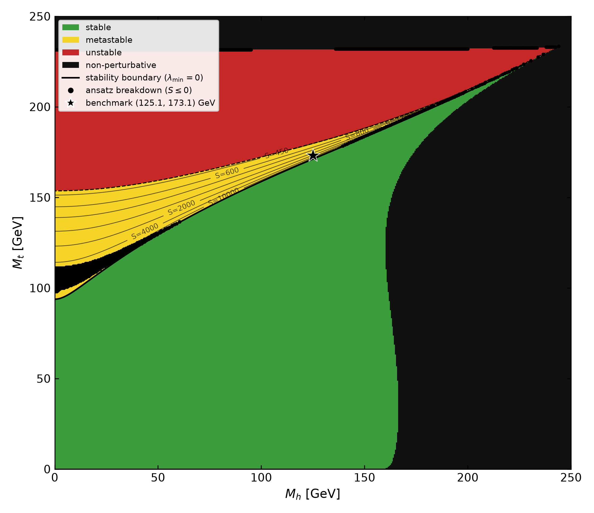
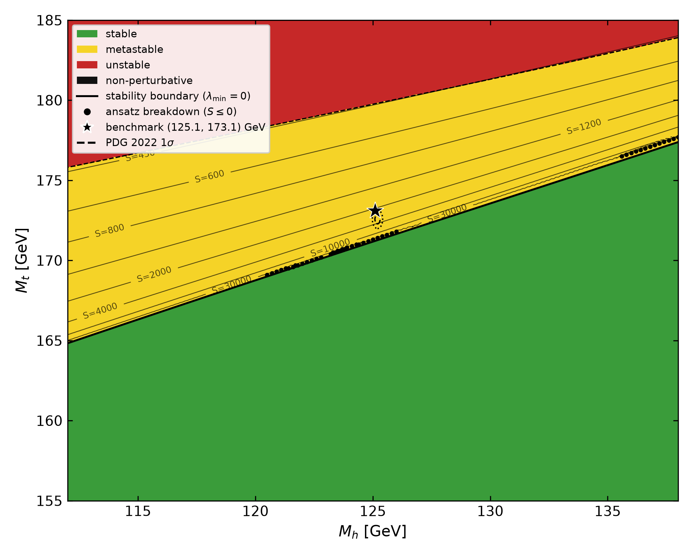
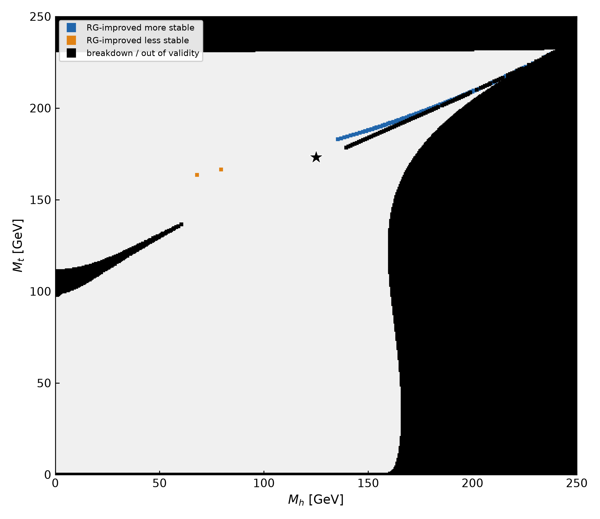

# SMVac-Research

Numerical study of electroweak vacuum stability in the Standard Model.

This repository implements a semi-analytical bounce-action estimator — the
Fubini–Lipatov (conformal) profile evaluated on the RG-improved 1-loop
effective potential — to investigate where the Standard Model vacuum is
absolutely stable, metastable, or unstable in the $(M_h, M_t)$ plane, and to
quantify when the strict conformal approximation is adequate.



*Extended computational visualization of the SM vacuum classification over
the full $(M_h, M_t)$ plane (trial-profile estimator, 0.5 GeV resolution).
**Green:** the RG-improved quartic coupling stays positive up to the Planck
scale (absolute stability). **Yellow:** the coupling turns negative but the
estimated decay action exceeds the age-of-the-universe threshold
(metastable). **Red:** the action falls below the threshold (unstable).
**Black:** the RGEs themselves leave their perturbative range. The solid
line is the $\lambda_{\min} = 0$ stability boundary; the star marks the
experimental point $(125.1, 173.1)$ GeV in the metastable region. Brown
dots along that boundary are ansatz-breakdown points — a documented
artifact of the fixed trial profile, not physical instabilities. **Caveat:**
the NNLO matching is linearized around $(125.15, 173.34)$ GeV, so regions
far from that window are extrapolations of the fit, not SM predictions;
the physically meaningful view is the zoom below.*



*The phenomenologically relevant window at 0.1 GeV resolution with the
PDG 2022 $1\sigma$/$2\sigma$ region and constant-action contours.*



*Classification difference map: where the strict conformal estimate and the
trial-profile evaluation disagree over the full plane. Differences
concentrate along the classification boundaries and are driven mainly by
the assumed $c_6 = 1$ Planck operator and by ansatz breakdown — a
comparison of two approximations, not a correctness statement (see
[docs/figures.md](docs/figures.md)).*


*Fractional difference $(S_{\rm trial}-S_{\rm conformal})/S_{\rm conformal}$
over the metastable region, with and without the assumed Planck operator.
At $c_6 = 0$ the trial-profile and conformal actions agree to ≲1%
everywhere — RG improvement alone barely moves the action inside this
trial family. The large differences at $c_6 = 1$ near the boundary are the
assumed Planck operator, not RG physics.*

The complete figure set — including the action-contour map, the
validity/breakdown map, the $S(R)$ decomposition, the RG-running panels,
and the numerical-convergence figure — is collected with full captions in
[docs/figures.md](docs/figures.md).

## What the code computes

1. **Matching.** NNLO electroweak matching conditions at the top scale
   (Buttazzo et al. 2013), linearized around the central masses.
2. **Running.** The 3-loop SM RG equations for
   $(g_1, g_2, g_3, y_t, y_b, y_\tau, \lambda)$ (plus the pure-QCD 4-loop
   $g_3$ piece), integrated by RK4 from $M_t$ to the Planck scale.
3. **Potential.** The RG-improved 1-loop effective potential
   $V(\phi) = \lambda_{\rm eff}(\phi)\,\phi^4/4$ with $\mu = \phi$ (the
   high-field approximation: the false vacuum sits at the origin).
4. **Action.** The Euclidean action evaluated on a restricted
   Fubini–Lipatov trial-profile family with running-coupling amplitude,
   minimized over the profile scale — a **trial-profile action estimate**,
   not a bounce solution (see below); plus the strict conformal estimate
   $S_{\rm conformal} = 8\pi^2/(3|\lambda_{\min}|)$.
5. **Classification.** Stable / metastable / unstable via the Coleman
   criterion $\Gamma/V \sim t_U^{-4}$ with $t_U = 10$ Gyr; points where the
   method fails (ansatz breakdown, fence, perturbativity loss) carry an
   explicit method flag and are never counted as physical verdicts.

**Scope and honesty of the method.** The bounce equation is *not* solved.
The code evaluates the Euclidean action on a restricted Fubini–Lipatov-type
trial-profile family and minimizes that action over the profile scale; the
result is a **trial-profile action estimate**. No inequality relating this
quantity to the exact bounce action is established here: the O(4) bounce is
a saddle point of the action, not a minimum over general field
configurations, so the trial action can lie above or below the true bounce
action. (Coleman, Glaser & Martin showed the bounce minimizes the action
only among *solutions of the equations of motion* — a class the fixed
trial profile does not belong to.) The *stability boundary*
($\lambda_{\min} = 0$) does not depend on the ansatz and is the robust
output. All approximations are documented in
[docs/theory.md](docs/theory.md) and
[docs/limitations.md](docs/limitations.md).

## Main results (reproduced by the committed data)

* The **absolute stability boundary** — the robust, ansatz-independent
  output — is at $M_h^{\rm crit}(M_t = 173.1) = 129.05$ GeV, within the
  published theory uncertainty of the NNLO anchor
  $129.4 \pm 1.0$ GeV (Degrassi et al. 2012, eq. (2) at the same inputs;
  this code omits their 2-loop potential and 3-loop QCD threshold pieces,
  so the comparison is a consistency check, not a validation).
* At the benchmark point $(M_h, M_t) = (125.1, 173.1)$ GeV the vacuum is
  **metastable**: $\lambda_{\rm eff}$ crosses zero at
  $\mu_1 \simeq 7.6\times10^{10}$ GeV and the trial-profile action
  ($S_{\rm trial} = 2168.7$ at $c_6 = 1$) far exceeds the metastability
  threshold ($484$), consistent with the literature consensus that the SM
  lifetime exceeds the age of the universe.
* **The Planck-suppressed operator dominates the near-boundary action.**
  Inside the trial family, RG improvement of the potential changes the
  action by $\lesssim 1\%$ ($S_{\rm trial}/S_{\rm conformal} - 1 =
  -0.08\%$ at the SM point, $-0.9\%$ at $(134.75, 176.5)$ with $c_6 = 0$).
  The assumed $\phi^6/M_{\rm Pl}^2$ operator with $c_6 = 1$ raises the
  action by up to $+33\%$ near the boundary ($c_6$-dependent; the
  coefficient is an assumption, not a prediction). Earlier drafts quoted
  this as an "RG improvement" effect of ≈30% — that was incorrect.
* With negative $c_6$ the trial action is unbounded below along the
  profile family ($S_{\rm trial} \to -10^{12}$ at $c_6 = -1$, SM point) —
  an explicit demonstration that no bound relation to the true bounce
  action exists for this method.

## Quick start

Requirements: a C++17 compiler (GCC, Clang, MSVC), CMake ≥ 3.10, Python 3
with `numpy`, `matplotlib`, `pandas` (figures only).

```bash
# Build and run the full test suite (11 tests: regression, unit, physics)
cmake -S . -B build && cmake --build build
ctest --test-dir build --output-on-failure

# Single point: both estimators with all diagnostics
./build/benchmark_point 125.1 173.1

# Regenerate a production dataset (every grid point actually evaluated;
# no interpolation is used anywhere)
python scripts/run_phase_diagram.py --mode numerical \
    --mt-min 0 --mt-max 250 --mh-min 0 --mh-max 250 --step 0.5 \
    --precision 8 --output data/numerical_full_plane_0p5GeV.csv   # ~35 min on 12 cores
python scripts/run_phase_diagram.py --mode numerical \
    --mt-min 155 --mt-max 185 --mh-min 112 --mh-max 138 --step 0.1 \
    --precision 8 --output data/numerical_zoom_0p1GeV.csv         # ~20 min on 12 cores

# Resolution-convergence check across all committed datasets
python scripts/check_resolution_convergence.py

# Regenerate all figures from the committed data
python scripts/make_figures.py
```

The committed datasets (`data/`), figures (`figures/`), and reference
tables (`reference/v1.1/`) are all regenerable from these commands; nothing
depends on machine-specific state.

## Repository layout

```
include/SMVacuumDecay/   library headers (RGE, potential, bounce, numerics)
src/                     physics implementation
apps/                    benchmark_point, generate_phase_diagram,
                         write_reference_tables, dump_diagnostics,
                         convergence_scan
tests/unit/              algorithm and constant checks
tests/physics/           analytic limits, convergence, literature comparison
tests/regression/        frozen-value reproducibility tests
docs/                    theory, numerical method, validation, limitations,
                         references, audit notes, code provenance
scripts/                 scan driver and figure generation (Python)
data/                    committed example datasets (+ README)
reference/v1.1/          frozen reference tables for the regression tests
figures/                 committed figures (generated by scripts/)
```

## Documentation

| document | content |
|---|---|
| [docs/theory.md](docs/theory.md) | physics problem, conventions, every equation, approximations |
| [docs/numerical-method.md](docs/numerical-method.md) | equation → algorithm → implementation → output mapping |
| [docs/validation.md](docs/validation.md) | what is validated, how, and with which numbers |
| [docs/limitations.md](docs/limitations.md) | consolidated known limitations |
| [docs/references.md](docs/references.md) | verified bibliography |
| [docs/audit-notes.md](docs/audit-notes.md) | pre-reorganization audit findings and dispositions |

## Known limitations (summary)

The full list with discussion is in
[docs/limitations.md](docs/limitations.md). The most important:

* the conformal profile is a variational ansatz — no bounce-equation solve.
  The resulting **trial-profile action has no established relation (bound
  or otherwise) to the exact bounce action**, and its trial-family
  dependence is unquantified (no independent bounce solver was run);
* the high-field potential omits the tree-level mass term (false vacuum at
  the origin, not the electroweak vacuum);
* the Planck-suppressed $\phi^6$ term is an **assumed** regulator with
  coefficient $c_6 = 1$; it dominates the near-boundary action and the
  sign/size of a physical Planck-scale operator are unknown (negative
  $c_6$ makes the trial action unbounded below);
* the decay-rate prefactor uses the $\lambda$ zero-crossing scale (a
  gauge-dependent quantity); the physically motivated $1/R_\ast$ scale
  would raise the threshold by $\sim 10\%$ (cf. Andreassen, Frost &
  Schwartz 2018);
* the $g_3$ running includes only the pure-QCD 4-loop piece
  ($-\beta_3(n_f{=}6) = -2472.28$); the remaining SM 4-loop terms are
  absent, so the running is not a complete 4-loop SM result
  (measured impact of the piece: $\sim 0.1\%$).

## Citation

If you use this code, please cite it via [CITATION.cff](CITATION.cff):

```bibtex
@misc{goyal2026smvacresearch,
  author       = {Naman Goyal},
  title        = {SMVac-Research: Numerical Study of Standard Model
                  Electroweak Vacuum Stability},
  year         = {2026},
  publisher    = {GitHub},
  howpublished = {\url{https://github.com/namangoyal31/SMVac-Research}},
  version      = {2.0.0}
}
```

## Provenance

This repository is the upgraded research codebase; the original working
repository (including bulk generated data and working analysis notes) is
preserved unchanged at
[namangoyal31/SMVac](https://github.com/namangoyal31/SMVac). The migration
of every physics function is documented in
[docs/CODE_PROVENANCE.md](docs/CODE_PROVENANCE.md), and the audit that
preceded the reorganization in
[docs/audit-notes.md](docs/audit-notes.md).

## Authorship and copyright

Copyright © 2026 Naman Goyal. All rights reserved — see [NOTICE](NOTICE).
No open-source license is granted with this repository.
